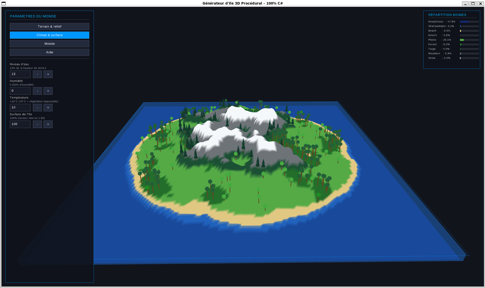

# Island World Generator

Générateur procédural d'île en 3D écrit en C# avec Raylib.

Le projet permet d'explorer l'influence du relief, de l'eau, de l'humidité et de la température sur la répartition des biomes. Le menu latéral permet de modifier les paramètres en direct et de régénérer le monde.



## Fonctionnalités

- Génération procédurale d'une île 3D.
- Relief basé sur du bruit fractal.
- Biomes calculés selon l'altitude, l'humidité et la température.
- Végétation cohérente avec le climat.
- Température extrême : à partir de 70°C, la végétation disparaît.
- Habitants minimalistes placés sur l'île, avec prénoms français, déplacements et sauts aléatoires.
- Menu vertical avec champs numériques éditables.
- Statistiques de répartition des biomes.
- Caméra orbitale avec déplacement relatif à l'orientation.

## Paramètres Principaux

- `Graine` : change la carte générée.
- `Taille des reliefs` : contrôle la taille des grandes formes du terrain.
- `Hauteur maximale` : amplifie la hauteur visible du relief.
- `Rugosité` : ajoute ou réduit les détails secondaires du relief.
- `Niveau d'eau` : définit la proportion immergée.
- `Humidité` : règle le climat global, avec équivalent en pourcentage.
- `Température` : influence désert, taïga, neige et végétation.
- `Surface de l'île` : agrandit ou réduit la masse terrestre.
- `Habitants` : choisit le nombre de petits personnages simulés sur l'île.

## Commandes

```bash
dotnet restore
dotnet run
```

## Contrôles

- Souris glissée : rotation de la caméra.
- Molette : zoom.
- `ZQSD`, `WASD` ou flèches : déplacement de la caméra.
- `R` : réinitialiser la caméra.
- `H` ou `Tab` : masquer/afficher le menu.
- `Espace` : générer une nouvelle graine.

## Prérequis

- .NET 8 SDK.
- Raylib-cs est restauré automatiquement via NuGet.
- La police utilisée par l'interface est embarquée dans `assets/fonts/`.
